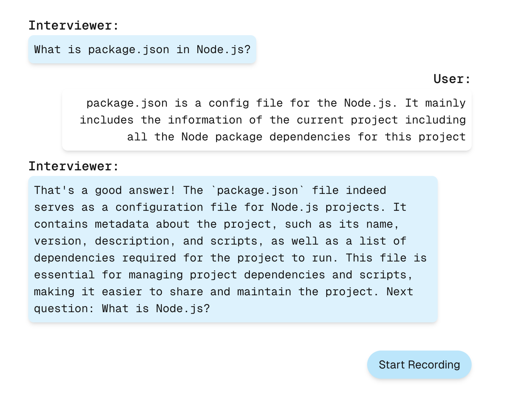

# AI Mock Interview

AI Mock Interview is a Next.js-based web application designed to help developers practice technical interviews. The AI acts as an interviewer, asking technical questions, providing feedback, and continuing like a real interview process. Users can record their answers and review past interview sessions.

## Features

- AI-powered technical mock interviews
- Real-time feedback on responses
- Session tracking for reviewing past answers
- Seamless user experience with an interactive UI

## Demo



## Getting Started

### Prerequisites

Ensure you have Node.js installed. You can download it from [Node.js official website](https://nodejs.org/).

### Installation

Clone the repository and install dependencies:

```bash
git clone https://github.com/zycarlc/mock_ai_interview.git
cd mock_ai_interview
npm install  # or yarn install
```

### Running the Project

Start the development server:

```bash
npm run dev
# or
yarn dev
# or
pnpm dev
# or
bun dev
```

Open [http://localhost:3000](http://localhost:3000) in your browser to use the application.

### Building for Production

To build the project for production, run:

```bash
npm run build
npm run start
```

### Environment Variables

Create a `.env` file in the root directory and configure the required environment variables:

```ini
LANGCHAIN_TRACING_V2="true"
LANGCHAIN_API_KEY="langchain-api-key"
LANGCHAIN_CALLBACKS_BACKGROUND="true"
AZURE_OPENAI_ENDPOINT='azure-open-ai-endpoint'
AZURE_OPENAI_API_INSTANCE_NAME_QUIZ='azure-instance-name'
AZURE_OPENAI_API_KEY='azure-openai-api-key'
```
